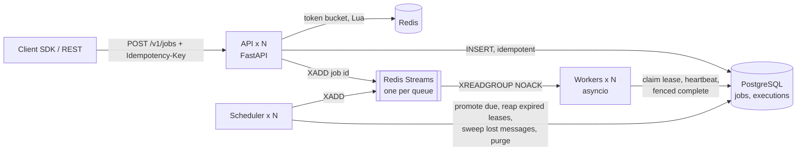

# jobq: distributed task scheduler and job queue

[](https://github.com/AnuragBhandary/Distributed-Job-Scheduler/actions/workflows/ci.yml)


A job platform in the spirit of Celery or Sidekiq, built around **correctness under failure**.
Jobs run now or on a schedule and retry with exponential backoff and jitter. Jobs that exhaust
their retries go to a dead-letter queue. Workers hold heartbeated **leases**, and every write is
**fenced**, so a crashed or frozen worker can never commit a job twice.

**Stack:** Python 3.12, asyncio, FastAPI, PostgreSQL (source of truth), Redis Streams
(dispatch) and Lua (rate limiting), Docker, GitHub Actions.

### Measured results ([details](docs/BENCHMARKS.md))

| 50,000 jobs at 2,000/min, a worker `SIGKILL`ed every minute, 5% of attempts failing | |
|---|---|
| Unrecovered failures | **0** (50,000 / 50,000 succeeded; 2,633 retries and 41 crash-interrupted jobs recovered) |
| Duplicate side effects | **0** (audited in SQL: one ledger row per job) |
| Enqueue latency | **p95 7.1 ms**, p99 8.2 ms |
| Peak throughput (same laptop) | **≈ 1,500 jobs/s** end-to-end, pickup p95 3.5 ms |

## Architecture



**PostgreSQL is the source of truth; Redis only carries hints.** Every state change is a single
conditional `UPDATE` that the database arbitrates. Redis can lose messages, or all of its data,
without losing a job: the scheduler's sweeper notices and dispatches again.

| Guarantee | How |
|---|---|
| Accepted jobs are never lost | Committed before the 2xx; leases + reaper recover dead workers; sweeper recovers lost messages |
| No duplicate jobs from client retries | `Idempotency-Key` + unique constraint; reuse with a different body → 409 |
| At-least-once execution | An expired lease is rescheduled (backoff, or DLQ when the budget is spent) |
| Exactly-once *effects* | Fencing token on every write; `ctx.transactional(sql)` commits side effects in the same transaction as the fenced completion |
| Horizontal scaling, no leader | `FOR UPDATE SKIP LOCKED` and conditional updates everywhere; run any number of each component |

The full reasoning, alternatives considered (Postgres-only polling, Redis-as-truth, Kafka, SQS)
and failure-mode analysis are in **[docs/DESIGN.md](docs/DESIGN.md)**.

## Quick start

```bash
docker compose up -d --build --wait          # Postgres, Redis, API, scheduler, 3 workers
export KEY=jq_0000000000de_local-dev-key-not-for-production   # dev-only bootstrap key

curl -s -X POST localhost:8000/v1/jobs -H "X-API-Key: $KEY" -H 'Content-Type: application/json' \
     -H 'Idempotency-Key: order-42' -d '{"task": "examples.fib", "args": [50]}'
curl -s localhost:8000/v1/stats -H "X-API-Key: $KEY"
```

Interactive API docs: http://localhost:8000/docs · Prometheus metrics: `/metrics`.

### Python SDK (Celery-style)

```python
from jobq import JobContext, JobQ, PermanentError, RetryLater

app = JobQ("http://localhost:8000", api_key="jq_...")

@app.task(max_attempts=5, queue="emails", timeout_s=30)
def send_welcome_email(user_id: int) -> str:
    ...

@app.task(bind=True)
async def charge(ctx: JobContext, order_id: int, cents: int) -> None:
    # ctx.idempotency_key is the job id: stable across retries, so the provider dedupes
    await payments.charge(order_id, cents, idempotency_key=ctx.idempotency_key)
    # runs in the same transaction as the fenced completion: commits exactly once
    ctx.transactional("UPDATE orders SET paid = true WHERE id = $1", order_id)

result = send_welcome_email.delay(42)                      # run now
send_welcome_email.apply_async(args=[7], countdown=3600)   # run in an hour
result.get(timeout=10)                                     # wait for the return value
```

Workers import the same module: `jobq worker --tasks myapp.tasks --queues default,emails`.
Tasks can `raise RetryLater(30)` to pick their own delay or `raise PermanentError(...)` to skip
straight to the DLQ.

### REST API

| Method | Path | |
|---|---|---|
| `POST` | `/v1/jobs` | Enqueue (`delay_s` or `run_at`, `max_attempts`, `timeout_s`, backoff); `Idempotency-Key` header |
| `GET` | `/v1/jobs` | List, keyset-paginated; filter by `status`, `queue`, `task` |
| `GET` | `/v1/jobs/{id}` | Job status, result, last error |
| `GET` | `/v1/jobs/{id}/executions` | Every attempt: worker, outcome, error, duration |
| `POST` | `/v1/jobs/{id}/cancel` | Cancel a job that has not started |
| `GET` | `/v1/dlq` | Dead-letter queue |
| `POST` | `/v1/dlq/{id}/requeue` | Retry a dead job with a fresh retry budget |
| `GET` | `/v1/stats` | Job counts per queue and status |
| `GET` | `/healthz`, `/readyz`, `/metrics` | Liveness, readiness (Postgres + Redis), Prometheus |

Authenticate with `X-API-Key` or `Authorization: Bearer`. Rate limits come back in
`X-RateLimit-*` headers, and 429s carry `Retry-After`.

## Testing

```bash
make infra   # Postgres + Redis in Docker
make check   # ruff, mypy, 88 tests with coverage gate (94%)
```

The tests run against real PostgreSQL and Redis, because the guarantees depend on real row
locking and stream semantics. **`tests/test_chaos.py`** starts real worker processes and:

- **SIGKILLs a worker mid-job.** Its leases expire, the reaper reschedules the jobs and another
  worker finishes them. Each of the 80 jobs has exactly one ledger row.
- **Freezes a worker with SIGSTOP** until its 10 jobs are taken over, then SIGCONTs it. The
  "zombie" finishes all its handlers, but every write is fenced off: still exactly one row per job.

## Project layout

```
src/jobq/
  api/            FastAPI app, routes, auth + rate-limit dependencies, schemas
  migrations/     SQL schema (applied by `jobq migrate`)
  repository.py   every SQL statement: claims, fencing, reaping, promotion
  dispatch.py     Redis Streams dispatch and lost-message detection
  worker.py       leases, heartbeats, timeouts, fenced completion, graceful shutdown
  scheduler.py    promote / reap / sweep / purge / gauge loops
  client.py       Celery-style SDK
  backoff.py      full-jitter backoff and the retry-or-dead decision
bench/            open-loop load generator + chaos monkey + database audit
docs/             DESIGN.md, BENCHMARKS.md, INTERVIEW.md
```
